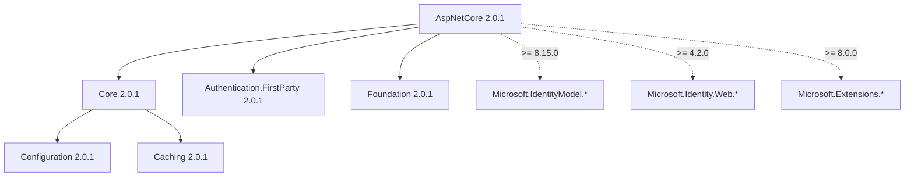

# dotnet-pkgs-ai-docs

Generate AI-ready documentation from NuGet packages — no source code required.

Given a set of `.nupkg` files, `dotnet-pkgs-ai-docs` produces:
- **Transitive dependency graphs** — full closure per target framework, with Mermaid diagrams
- **Public API surface** — every public type and member, per target framework

The output is structured Markdown optimized for AI coding agents (GitHub Copilot,
Copilot SWE Agent, Claude, etc.) but equally useful for humans.

## Why?

AI agents migrating codebases between SDK versions need two things:
1. **What packages does a library bring in?** Not just direct deps — the full transitive tree,
   so the agent knows what to add, remove, or upgrade.
2. **What types and methods are available?** So the agent can write correct code
   without guessing or crawling the NuGet cache.

No existing tool answers these questions from `.nupkg` files:
- `dotnet list package --include-transitive` requires source code and works per project
- NuGet Package Explorer is GUI-only, not batch or machine-readable
- GenAPI needs a build context, not release artifacts
- No tool analyzes a *set* of packages together showing cross-package relationships

This tool takes the release artifacts themselves and produces documentation that agents can consume.

## Installation

```bash
dotnet tool install --global dotnet-pkgs-ai-docs
```

Or build from source:

```bash
git clone https://github.com/jmprieur/pkgs-ai-docs.git
cd pkgs-ai-docs
dotnet build
```

## Usage

### Transitive dependency graph

```bash
dotnet-pkgs-ai-docs deps ./packages/ -o ./output/
```

For each package and target framework, generates:
- Mermaid dependency diagram
- Classified dependency list (1P vs external)
- Version constraints

### Public API surface

```bash
dotnet-pkgs-ai-docs api ./packages/ -o ./output/
```

For each package and target framework, generates:
- Every public namespace, type, and member
- Roslyn `PublicAPI.Shipped.txt` format (one member per line, fully qualified, sorted)

### Both at once

```bash
dotnet-pkgs-ai-docs all ./packages/ -o ./output/
```

### Options

| Option | Description | Default |
|--------|-------------|---------|
| `-o, --output` | Output directory | `./pkgs-ai-docs-output/` |
| `--source` | Additional NuGet source(s) for transitive resolution | `nuget.org` + local folder |
| `--format` | Output format: `md`, `json`, or `both` | `md` |
| `--1p-prefix` | Package ID prefix(es) to classify as first-party | _(none)_ |

### Custom NuGet sources

If your packages depend on packages from private feeds:

```bash
dotnet-pkgs-ai-docs deps ./packages/ -o ./output/ \
  --source https://pkgs.dev.azure.com/myorg/_packaging/myfeed/nuget/v3/index.json \
  --source https://api.nuget.org/v3/index.json
```

### First-party classification

Group packages by ownership in the dependency output:

```bash
dotnet-pkgs-ai-docs deps ./packages/ -o ./output/ \
  --1p-prefix Microsoft.Identity.ServiceEssentials \
  --1p-prefix Microsoft.Identity.SettingsProvider
```

## Example output

### Dependency graph (Markdown + Mermaid)

````markdown
## Microsoft.Identity.ServiceEssentials.AspNetCore 2.0.1

### net8.0



**1P packages (version managed by metapackage):**
- Microsoft.Identity.ServiceEssentials.Core >= 2.0.1
- Microsoft.Identity.ServiceEssentials.Authentication.FirstParty >= 2.0.1
- Microsoft.Identity.ServiceEssentials.Foundation >= 2.0.1

**External packages (pulled in transitively):**
- Microsoft.IdentityModel.Abstractions >= 8.15.0
- Microsoft.Identity.Web >= 4.2.0
- Microsoft.Extensions.Caching.Abstractions >= 8.0.0
````

### Public API

````markdown
## Microsoft.Identity.ServiceEssentials.Core 2.0.1

### net8.0

```
Microsoft.Identity.ServiceEssentials.AuthenticationTicket (class)
Microsoft.Identity.ServiceEssentials.AuthenticationTicket.AuthenticationTicket(ClaimsIdentity, string) -> void
Microsoft.Identity.ServiceEssentials.AuthenticationTicket.SubjectIdentity.get -> ClaimsIdentity
Microsoft.Identity.ServiceEssentials.IMiseBuilder (interface)
Microsoft.Identity.ServiceEssentials.IMiseBuilder.Services.get -> IServiceCollection
Microsoft.Identity.ServiceEssentials.MiseAuthenticationDefaults (static class)
Microsoft.Identity.ServiceEssentials.MiseAuthenticationDefaults.AuthenticationScheme -> string
```
````

## How it works

### Dependency resolution

1. Extracts `.nuspec` from each `.nupkg` (it's a zip file)
2. Discovers supported target frameworks from `<dependencies>` groups and `lib/` structure
3. Creates a temporary `.csproj` per package × TFM with a single `<PackageReference>`
4. Runs `dotnet restore` with configured NuGet sources (including the input folder as a local source)
5. Parses `obj/project.assets.json` for the complete resolved dependency tree
6. Classifies packages as 1P or external based on `--1p-prefix` rules
7. Generates Markdown with embedded Mermaid diagrams

### Public API extraction

1. Extracts assemblies from `lib/<tfm>/` inside each `.nupkg`
2. Loads assemblies into `System.Reflection.MetadataLoadContext` (metadata-only, no code execution)
3. Resolves type references using sibling DLLs and .NET reference assemblies
4. Enumerates all public namespaces, types, and members
5. Outputs in Roslyn `PublicAPI.Shipped.txt` format

## Use with AI agents

The generated Markdown files are designed to be included in AI agent context:
- As **GitHub Copilot skills** — drop the output in `.github/skills/`
- As **custom instructions** — reference in `.copilot-instructions.md`
- As **agent context** — include in prompts for migration or upgrade tasks

## CI/CD Integration

### Azure Pipelines

```yaml
- script: dotnet tool install --global dotnet-pkgs-ai-docs
  displayName: 'Install pkgs-ai-docs'

- script: dotnet-pkgs-ai-docs all $(NugetDirectoryPath)\1P -o $(Build.ArtifactStagingDirectory)\package-metadata --1p-prefix Microsoft.Identity.ServiceEssentials
  displayName: 'Generate package metadata'
  continueOnError: true
```

### GitHub Actions

```yaml
- run: dotnet tool install --global dotnet-pkgs-ai-docs
- run: dotnet-pkgs-ai-docs all ./packages/ -o ./output/
- uses: actions/upload-artifact@v4
  with:
    name: package-metadata
    path: ./output/
```

## Requirements

- .NET SDK 8.0 or later (for `dotnet restore` during dependency resolution)
- Works on Windows, Linux, and macOS

## Contributing

Contributions welcome! Please open an issue to discuss before submitting a PR.

## License

[MIT](LICENSE)

## Authors

Jean-Marc Prieur ([@jmprieur](https://github.com/jmprieur)) — with Bridge (GitHub Copilot)